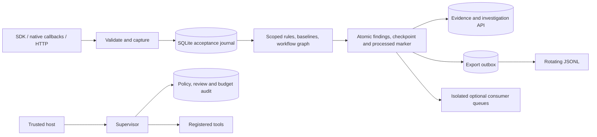

# Runtime and evidence contracts

Fisheye separates durable acceptance from analysis and external delivery. The default runtime is a local journal-backed pipeline; a custom runtime around `AsyncEventBus` alone does not provide durability.

## Acceptance and recovery

An event is accepted when its SQLite transaction commits. WAL mode and `synchronous=FULL` are enabled. The receipt includes `durable`, `duplicate`, and the journal sequence. Acknowledgment does not mean every detector or collector has completed.

Event IDs identify producer events. A keyed digest compares original input before redaction, excluding arrival and internal processing metadata. An identical retry returns its existing receipt. Reusing an ID with different content fails, even when both payloads redact identically. Preserve IDs and event timestamps on retries. The digest key lives in the database and is included in backups.

Analysis reads accepted events in journal order. Each transaction writes event/alert projections, correlated findings, detector signals, errors, the latest checkpoint for each affected scope, outbox entries, and processed markers. A failed transaction commits none of them. After restart, pending events resume from the last checkpoint. A process-exit test exercises an abrupt exit after projection insertion and before commit.

Batch acceptance is all-or-nothing. HTTP ingestion preserves its per-event receipt contract: a 409/429 can contain receipts for earlier accepted events. Inspect receipts and retry with unchanged IDs. A 202 means acceptance succeeded while analysis or export is still pending/degraded.

SQLite serializes concurrent producers and supervised action claims. Run **one analysis runtime per database**. An OS-held `.analysis.lock` rejects a second local analyzer and is released when its owner closes or exits. It is not distributed leader election; keep the database and lock on a local filesystem, use one canonical database path, and never delete an active lock file. Use a single HTTP collector process for multiple remote producers. Other journal connections may accept events; the analyzer polls for their work every `storage.poll_interval_seconds` (default 0.25 seconds).

## Export and consumers

The JSONL exporter reads a durable outbox and flushes file writes before acknowledging entries. A crash between writing and acknowledgment can duplicate lines. Downstream readers should deduplicate by event/alert ID. Rotation retains the active file and one `.1` file, each approximately 10 MiB; use journal export for a complete retained recording.

Optional bus consumers have independent bounded queues, processing/error/drop counters, and retries. The default runtime's optional queues drop on overload with visible counters. They are best-effort projections and are not replayed after a process crash. Integrations needing recoverable delivery must use a durable outbox; JSONL is the supplied implementation.

`drain(timeout)` waits for current callbacks, journal processing, export, preprocessing, and consumer queues. Callback/plugin/export failures have distinct diagnostics. `stop()` drains with a finite timeout and stops tasks. `aclose()` and context managers also close storage. Do not share an async runtime between unrelated event loops; use its sync wrapper for synchronous producers.

The drain timeout covers the entire operation, including post-commit consumer projection. Timing out a drain waiter does not cancel outstanding producer callbacks. Optional projection failures are counted separately in `projection_errors` with a `projection_last_error` type; one failed route does not suppress delivery to other routes or later events. Shutdown cleans up workers even when a preprocessor fails to flush.

## Identity, causality and bounded state

Version 2 adds application, environment, workflow, task, agent instance/version, producer sequence, trace/span IDs, and explicit source links. Version 1 input remains accepted. Its `run_id` is a legacy workflow group; relationships are unknown unless supplied. Relationship payloads are validated regardless of envelope version.

The graph follows explicit links, including sources arriving after sinks. Monitors cover instruction propagation, sensitive transfers, delegation and wait cycles, duplicate assignments, incomplete output contracts, uncompleted/deadline tasks, tool authority, and aggregate usage. A source containing both sensitive data and an instruction can produce both findings.

Graph history defaults to 2,000 events. Nodes retain structural fields and 256-character excerpts; the complete captured payload stays in the journal. Eviction sets `truncated` on graph/evidence. Missing or evicted edges reduce coverage. Cross-workflow graph traversal and authenticated delegation grants are not implemented. Delegation `allowed_tools=[]` means unspecified observational authority; enforce an empty grant through a supervisor policy with `allowed_tools=set()`.

Detector and behavioral state is checkpointed per workflow. Plugin metadata controls version resets, schema/event applicability, agent/workflow scope, content requirements, timeout, state TTL, and serialized size. Behavioral histories are bounded and use prior observations, warmup, optional frozen baselines, and outlier quarantine. Plugin failures preserve other detectors' progress and record the plugin/error type. In-process plugins are trusted code: cooperative async timeouts cannot stop CPU-bound or malicious Python.

Workflow checkpoints expire after configured inactivity, except where pending events require them. Expired analysis state starts fresh on later events; use longer TTLs for long-lived workflows. Event retention is separate from state expiry.

## Findings, replay and privacy

Findings correlate repeated signals and retain lifecycle labels, evidence IDs, configuration versions, and heuristic score semantics. A heuristic score is not a calibrated probability. Status changes are audited. Open/acknowledged findings retain referenced evidence through ordinary pruning.

Capture derives sensitive/instruction features locally before redaction or content removal. Redacted capture applies to journal data, projections, checkpoints, findings, review previews, and exports. Raw capture is a deliberate storage choice. Feature capture may make content-dependent plugins report `insufficient_input`. Detector coverage is diagnostic; absence of a finding does not prove safety.

Replay shares the configured analysis factory with live processing. It reuses recorded derived annotations and never executes action tools. Treat imported recordings as trusted offline inputs: remote producers cannot supply trusted derived annotations. Optional semantic evaluation runs only when the host explicitly installs a provider. Its cost and timeout accounting are safeguards, and judgments are labeled advisory.
