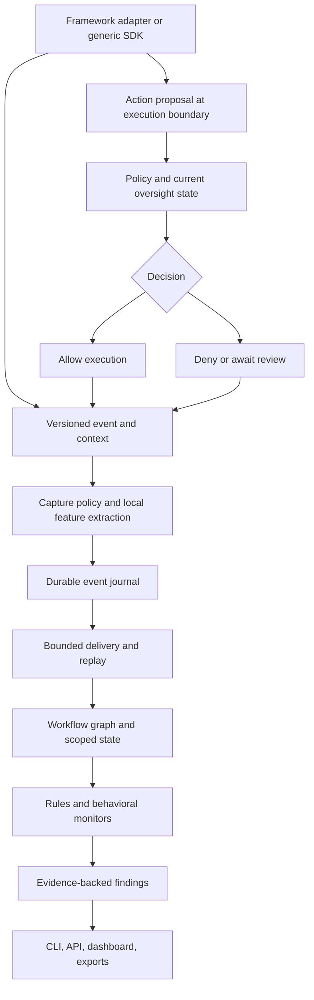

Fisheye overhaul proposal

Design baseline: commit `d070461`. This proposal describes the intended architecture and delivery gates. See the release notes for implemented capabilities and validation results.

The proposed direction is a Python oversight library that reconstructs how agents collaborate, detects failures and policy violations with traceable evidence, and optionally supervises actions before they execute. Keep installation and local operation simple. Make production oversight the primary design assumption, with debugging and research evaluation built on the same event and replay model.

The original [simple spec](legacy/simple_spec.md) emphasizes flexible routing, preprocessing, and monitoring. The [MVP spec](legacy/spec.md) explicitly limits the product to alerts. Preserve observation as the default mode; add active supervision as a separate, opt-in capability. This is a proposed scope expansion, not a claim that the existing MVP promised enforcement.

The product should answer five questions: What happened? Which agents, messages, and tools caused it? What evidence supports the finding? What action is permitted now? Can we reproduce and evaluate that decision?

**Evidence from the current implementation.** The existing adapter, preprocessor, collector, and detector boundaries are useful starting points. SQLite and JSONL remain appropriate local backends. The problems are both correctness defects and missing concepts.

All 22 existing tests passed under an isolated Python 3.12.13 environment. Additional one-off probes confirmed the failures below. The suite does not currently establish framework compatibility, detection quality, durability, or reliable synchronous operation.

| Priority | Finding and source | Consequence and required change |
| --- | --- | --- |
| P0 | [Sync runtime](../fisheye/sync/wrappers.py) calls `asyncio.run()` for each operation; [adapter dispatch](../fisheye/adapters/base.py) does the same outside a running loop. A start/publish/drain probe delivered zero events and timed out. | Own one persistent loop for sync callers, track callback submissions, and provide deterministic flush and close. |
| P0 | [EWMA](../fisheye/behavior/online_stats.py) incorporates a sample before scoring it. With default alpha 0.2, the absolute score is bounded by `(1-alpha)/sqrt(alpha)`, approximately 1.789, below the [monitor](../fisheye/behavior/monitor.py)'s threshold of 3. | Default z-score-based alerts cannot fire for finite observations. Score against the prior baseline, then update under an explicit learning policy. The separate categorical drift path is not covered by this bound. |
| P0 | [Bus](../fisheye/bus/async_bus.py) drops on full queues while [HTTP ingestion](../fisheye/api/routes.py) counts publishes as ingested. A queue-size-one probe acknowledged 10 inputs while recording 76 dropped subscription deliveries. | Define acceptance, durability, processing, and overload separately. Return delivery receipts; never describe a dropped event as durably accepted. Route projections currently also inflate bus counts. |
| P0 | [Default routing](../fisheye/runtime.py) stores raw events; [alert emission](../fisheye/detectors/engine.py) sends evidence directly to sinks. With secret redaction enabled, a test secret disappeared from the event log but remained in the alert log. | Apply explicit capture and export policies to events, signals, findings, and all evidence. A route named `redacted` must have an enforced contract. |
| P0 | [Dashboard routes](../fisheye/api/routes.py) lack the API authentication dependency. Probe: `/v1/alerts` returned 401 while `/dashboard` returned 200. An invalid event returned 500. | Protect every data-bearing endpoint consistently and return structured validation errors. |
| P0 | [Exfiltration detector](../fisheye/detectors/exfiltration.py) returns early when sensitive content is found, before checking whether that content is being sent outbound. Direct secret egress scored 0.59, below the default 0.7 threshold. | Evaluate exposure and actual outbound movement together; add destination policy and provenance. |
| P1 | [SQLite event writes](../fisheye/collectors/sqlite_store.py) replace duplicate IDs but increment run counts each time; a run row records one agent. A duplicate plus a second agent produced two stored events and a count of three. | Use immutable, idempotent ingestion, explicit workflow membership, and derived counts. |
| P1 | [Event schema](../fisheye/schema/events.py) lacks schema versions, workflow/task/delegation/message identities, and typed payload contracts. Detector state groups by run; behavioral state groups by agent across runs. | Define intentional scopes and causal relationships so unrelated activity does not contaminate findings or baselines. |
| P1 | Framework adapters are small wrappers/shims, and [adapter tests](../fisheye/tests/test_routing_and_adapters.py) use dummy runtimes. The [multi-agent test](../fisheye/tests/test_multi_agent.py) verifies two independent runs are queryable. | Test actual framework lifecycles and interacting agents, including concurrent tools, handoffs, errors, and cancellation. |
| P1 | [Buffering](../fisheye/preprocessors/buffering.py) checks time only when another event arrives; [feature-only projection](../fisheye/preprocessors/features.py) retains arbitrary metadata. | Give buffering a real timer/flush lifecycle and construct allowlisted projections across the entire envelope. |
| P1 | Detector/baseline state is in memory with no explicit expiry or checkpoint contract; detector exceptions can restart the whole engine's event handling through collector retry. | Bound state, isolate plugins, and separate analysis from durable signal delivery. |
| P2 | [Packaging](../pyproject.toml) references a missing `docs/spec.md` within `dgs-final`; server dependencies are mandatory; there is no checked-in CI workflow or runnable integration example. | Make installed artifacts, lightweight imports, examples, and compatibility checks release requirements. |

**Architecture and contracts.** Retain a modular monolith with explicit interfaces. Introduce observation and supervision paths sharing identity, policy, and evidence models. Supervision must run at a trusted execution boundary before the side effect; an asynchronous collector cannot provide that guarantee.

The diagram describes durable operation. Embedded users may explicitly select a lighter, best-effort profile whose receipts and health reports identify that limitation. Neither profile should force a web server or external broker into the application.

| Contract | Proposed responsibilities |
| --- | --- |
| `Event` | Versioned envelope, bounded JSON-native payload, producer identity and sequence, event and observation times, application/environment scope, trace context, and typed standard payloads. Keep namespaced custom events. |
| `Workflow`, `AgentInstance`, `Task` | Separate the overall workflow execution from individual agent invocations and tasks. Record role, parent delegation, lifecycle, and membership. Keep stable agent definitions separate from instance IDs and baseline cohorts. |
| `Message`, `Artifact`, `Action` | Identify senders/recipients, content references, data classifications, tool calls/results, and authority carried through delegation. Support links across multiple runs. |
| `Signal` | Detector/version, scope, heuristic score, evidence references, required/observed inputs, and applicability status. Missing telemetry or incompatible privacy projections means insufficient coverage, not a clean result. |
| `Finding` | Correlated signals, severity, score semantics, affected agents/tasks, causal evidence path, lifecycle, and policy/model/config versions. Distinguish heuristic scores from calibrated probabilities. |
| `Decision`, `ReviewRequest` | Allow/deny/require-review, reason, exact action digest and scope, expiration, reviewer identity, state transitions, and enforcement acknowledgement. |
| `PluginSpec` | Version, supported schema/events, input sensitivity requirements, state scope, timeout/cost budget, configuration schema, and checkpoint compatibility. |

Use OpenTelemetry trace IDs, parent context, and span links for interoperability. Links can connect spans across traces, making them useful for handoffs and fan-in; Fisheye should still model task and authority relationships explicitly. This recommendation builds on the [OpenTelemetry tracing API](https://opentelemetry.io/docs/specs/otel/trace/api/#link). Map model/tool telemetry through a versioned adapter to the [official GenAI conventions](https://github.com/open-telemetry/semantic-conventions-genai), keeping Fisheye's public domain schema independent of convention changes.

Define a compatibility reader for v0.1 events. Do not infer a delegation from timestamps or silently redefine an old `run_id` as an agent invocation. Import old runs as legacy groups with unknown relationships; accept explicit migration mappings where callers have the information.

**Multi-agent oversight should be the distinguishing capability.** Build an incremental graph of delegation, message delivery, artifact use, and tool execution. Partition it by application and workflow; allow explicitly linked workflows where authorized. Start with indexed adjacency data and SQL projections. Bound retained graph state by lifecycle, time, and size.

| Monitor family | Concrete behavior | Evidence required |
| --- | --- | --- |
| Delegation and authority | An agent delegates an action beyond its allowed tools, destinations, or spending limit; a recipient claims authority not granted by the sender. | Authenticated producer context, delegation grant, action proposal, and applicable policy. |
| Injection propagation | Untrusted retrieved/tool content reaches agent A, is forwarded to B, and precedes a privileged action by B. | Source classification, explicit message/artifact links, destination action, and relevant content evidence. |
| Data movement | Sensitive data passes between agents and reaches a disallowed outbound channel. | Sensitive artifact labels or protected fingerprints, transfer links, destination policy, and outgoing action. |
| Coordination failures | A delegation cycle, repeated handoff, duplicate work, orphan task, or wait cycle prevents progress. | Task transitions, delegation graph, heartbeat/deadline evidence, and progress markers. A long-running task alone is insufficient. |
| Shared resource exhaustion | Individually modest agents collectively exceed tool, token, cost, concurrency, or time budgets. | Workflow-level counters, attributable usage, and policy. Concurrent actions require atomic budget reservations. |
| Behavioral deviation | A comparable agent role changes tool use, latency, error rate, or messaging behavior. | Baseline cohort/version, sample count, prior statistics, observed deviation, and warmup/coverage status. |
| Output contracts | A task completes without required evidence, violates an output schema, or omits a required verification step. | Declared task contract, artifact references, and verification events. Semantic correctness checks remain optional evaluators. |

Preserve simple rules as explainable baseline detectors. Fix their failure cases and distinguish quoted attack text, trusted instructions, untrusted tool output, and actual execution intent. In particular, current prompt-injection rules inspect message text but do not scan tool results for new injection instructions.

Treat model-based semantic judges as optional plugins after deterministic detectors and evaluations are established. Give them structured outputs, timeouts, privacy restrictions, and cost budgets. Record their model/prompt versions and uncertainty. Their conclusions should not become the sole basis for an irreversible action.

For behavioral models, score against the previous baseline, enforce minimum sample counts and variance floors, separate learning from scoring, and support frozen baselines. Select cohorts by application, agent role/version, and workload. Quarantine suspect samples from automatic learning and require a deliberate update policy. Measure tool errors per completed tool attempt rather than per arbitrary telemetry event. Add replayable checkpoints and explicit drift/reset behavior.

**Reliable delivery and state.** Make event acceptance an explicit API contract. In durable mode, acknowledge only after the sanitized canonical event commits to a journal; downstream consumers process with at-least-once delivery and idempotent effects. Repeating an identical event ID returns the existing receipt; repeating it with different content is a conflict. Optional exporters can fail independently without invalidating the accepted event.

Separate admission limits from consumer queues. Configure reject, bounded wait, or explicit best-effort drop by route; surface overload as structured SDK results or HTTP 429/503 responses. Expose event counts separately from projection and subscription delivery counts. Add per-consumer lag, retries, oldest pending age, failures, dead letters, and durable backlog size.

Use bounded workers, tracked tasks, cancellation-safe cleanup, collector timeouts, and one persistent sync loop. Route directly to subscribers needing a projection before enqueueing it. Immutable event data or isolated projections prevent one plugin mutating another plugin's input. Flush timers must run during idle periods.

Maintain per-producer ordering and per-workflow processing where required. Preserve event time and ingest time; define allowed lateness, clock-skew handling, and late-event correction. Do not invent a global order from wall-clock timestamps. Record enough versions and checkpoint offsets to replay state consistently.

Start with batched SQLite writes, a single writer, WAL configuration, schema migrations, retention, and an outbox/checkpoint mechanism that coordinates consumer progress with emitted findings. Keep JSONL for export and portable replay. Storage, state, and query protocols should allow another backend later. Do not promise exactly-once external side effects: tools need their own idempotency and reconciliation semantics.

**Privacy and trust boundaries.** Make persisted/exported content redacted or minimized by default; raw capture requires explicit selection and retention. A trusted local stage can extract sensitive-content signals before disposal. A detector declares what information it needs; configuration validation rejects incompatible routes or marks the detector unavailable. Privacy modes must preserve enough structured information to remain useful without silently promising unchanged detection quality.

Apply policy to payloads, metadata, tags, evidence, error messages, logs, exports, and review displays. Construct feature-only envelopes from an allowlist. Treat embeddings and stable hashes as potentially sensitive derived data. Support keyed fingerprints with scope and rotation when correlation is needed. Avoid describing redaction as a guarantee that arbitrary content is anonymous.

For a remote collector, bind application/producer identity and allowed scopes to authenticated credentials rather than trusting supplied IDs. Protect all data routes, bound payloads/batches, paginate queries, and audit review/policy changes. The initial deployment boundary is one trusted application/team; enterprise tenancy and SSO can follow demonstrated demand. A plugin running in the host process is trusted code. A library cannot supervise actions that bypass its hooks; stronger adversarial enforcement requires a trusted tool gateway or sandbox outside the agent's control.

**Optional action supervision.** Expose a pre-action API returning allow, deny, or require-review. Use explicit policies for tools, destinations, delegation depth, sensitive data movement, and aggregate budgets. Observation remains available without these hooks, and each adapter reports whether it supports observation, pre-action decisions, pause/resume, or cancellation.

Bind approvals to an immutable action digest, actor/workflow, policy version, expiration, and one-time use. A changed action requires a new decision. Persist review transitions and reject expired, duplicate, unauthorized, or stale approvals. Atomically reserve shared budgets before concurrent actions, then reconcile measured usage. Denied, pending, and expired actions must not execute through a supervised boundary.

Define timeouts and failure behavior per action class: observation failures may degrade visibly; protected actions require an explicit decision or configured denial. Distinguish a requested pause/cancel from confirmed enforcement. Capture the action result independently from the approval, including ambiguous outcomes after a crash. Replay evaluates historical decisions without executing tools.

**Developer and operator experience.** Provide a small public API with async and sync context managers, automatic context propagation, typed tool wrappers, and decorators. Users should be able to run one example and see an interacting-agent workflow locally without credentials. Move server, UI, framework, embedding, and telemetry dependencies into extras where practical.

Deliver the generic SDK plus one real framework integration end to end first. Select that framework using an actual intended workload; if none is available, use the existing LangChain integration as the first validation target. Bring the existing Camel and OpenAI Agents adapters through the same compatibility suite afterward. Publish an exact tested version matrix and capability table rather than equating callback names with supported integration.

The dashboard should support investigation: workflow graph and timeline, agent/task status, resource usage, grouped findings, evidence paths, and coverage/collector health. Add a review inbox only when supervision exists. A user should be able to move from a finding to the originating message and affected action, label a false positive, resolve the finding, and compare a detector change by replaying the run. Repeated signals should update a finding rather than flood the feed.

CLI commands should cover `doctor`, `record`, `replay`, `inspect`, `evaluate`, and policy validation in addition to serving and listing data. Configuration should be typed and validated with documented precedence across code, files, environment, and CLI, and a redacted effective-config view. Configuration snapshots receive version hashes used in findings and replay reports.

**Delivery sequence.** Estimate staffing and dates after validating the first real integration and benchmark workload. The dependency order below is more useful than a calendar promise; each milestone has a user-visible outcome and a release gate.

| Milestone | Work and primary modules | Completion gate |
| --- | --- | --- |
| 0 — Trustworthy baseline | Fix confirmed P0 defects in `sync`, `bus`, `behavior`, `detectors`, `api`, and privacy routing. Add regression coverage, package smoke checks, and CI. Specify the v2 acceptance/privacy contracts before larger refactors. | Sync delivery works; default anomaly tests fire appropriately; direct secret egress is detected; protected dashboard and structured invalid-input errors work; overload and redaction tests pass. |
| 1 — Versioned core | Add schema/domain identities, runtime lifecycle, journal/receipt contracts, storage migrations, bounded scoped state, plugin metadata, privacy projections, and v0.1 import. | Old fixtures import with explicit limitations; identical retries are idempotent; accepted events survive restart; a failing plugin does not prevent other detectors processing; scope isolation tests pass. |
| 2 — Complete multi-agent observation | Generic SDK, first native integration, delegation/message/artifact graph, injection/data-transfer/coordination monitors, first investigation view, and replay/evaluation CLI. Build the acceptance scenario below. | One causal finding spans multiple agents with the correct evidence chain; an unrelated simultaneous workflow remains unaffected; reordered and duplicated delivery does not corrupt results. |
| 3 — Detection and usability quality | Better statistical baselines, output/resource contracts, finding deduplication/lifecycle, labeled benchmark corpus, detector comparisons, query/filter UX, and operational metrics. | Published quality/latency reports cover benign and adversarial cases; baseline warmup, drift, false positives, and insufficient coverage are visible. |
| 4 — Supervised execution | Policy evaluator, action gate, aggregate budget reservations, durable review requests, approval/resume hooks, and review UI/CLI. | A denied or pending action never invokes the test tool; concurrent agents cannot overspend the reserved budget; stale approvals fail; restart preserves pending reviews. |
| 5 — Supported release | Additional existing framework integrations, exact compatibility matrix, installable examples, migration guide, performance/soak/fault tests, retention/export operations, release automation. | Installed wheel works outside the source tree; each advertised integration passes real lifecycle tests; crash recovery, backlog drain, and bounded-state requirements pass. |

Milestone 2 is the first substantial overhaul release. It delivers a complete multi-agent investigation loop. Milestone 4 introduces supervision only after event integrity, evidence, and evaluation are trustworthy. Documentation, tests, and privacy checks ship within each milestone.

A sensible first set of changes is: (1) persistent sync runtime plus callback submission tracking, (2) behavioral scoring and exfiltration regressions, (3) data-route auth, validation, and evidence redaction, (4) publish receipts and direct route selection, (5) v2 identity/schema compatibility reader, and (6) idempotent journal and state/replay foundation. Keep these reviewable and avoid combining the whole overhaul into one rewrite.

**Acceptance scenario.** Use a planner, researcher, and executor. The researcher receives an untrusted document containing an instruction to upload a classified artifact. A delegation/message chain carries it to the executor. The observation path must identify the source, transfers, affected artifact, proposed destination, and relevant policy in a single correlated finding. The supervised path must stop a disallowed upload before the test tool is called, or persist an explicit review request when the policy requires review. A benign quotation of the same text, an authorized transfer, and a concurrent unrelated workflow are negative controls. Duplicate delivery, shuffled timestamps, a collector failure, and a restart exercise reliability.

**Evaluation and release gates.** Keep an offline scenario format containing events, expected relationships/findings/decisions, and labels. Replay consumes recorded tool results without contacting tools or models unless an evaluator is explicitly requested. Snapshot configuration, detector/baseline versions, clock behavior, and relevant random seeds. Model outputs may be recorded for repeatability; do not promise deterministic live model inference.

Measure precision and recall per detector/scenario family, false findings per 100 benign workflows, time to finding, evidence-chain accuracy, and duplicate findings. Separate train/tuning fixtures from held-out scenarios. Do not advertise a universal prompt-injection accuracy number based on hand-written examples. Establish numeric detector gates after the initial labeled corpus and baseline report; publish sample counts and uncertainty with results.

Use the following provisional engineering targets, subject to a recorded reference workload and hardware. They are design goals, not measurements of the current code:

- Sustained 1,000 events/second for 30 minutes with representative 2 KiB events, four consumers, and the default rule set; report p50/p95/p99 acceptance and finding latency. Target p95 accepted-to-finding below 200 ms with zero unaccounted event loss.
- Local deterministic pre-action evaluation p95 below 10 ms, measured separately from durable audit writes, model judges, remote calls, and human waiting. Also report the full proposal-to-decision latency.
- Crash/restart and retry tests preserve all durably accepted events, consumer progress, pending reviews, and idempotent derived records. Inject failures at journal, checkpoint, and finding commits.
- A 24-hour run with many short workflows demonstrates bounded live state and a stable post-expiry memory footprint. Disk use follows configured retention and backlog limits.
- End-to-end canary tests find no test secrets in default logs, persisted projections, findings, exports, or review displays. Explicit raw-capture tests verify the configured scope and expiry.
- Framework integration tests cover streaming completion, nested/concurrent tools, messages/handoffs, cancellation, exceptions, sync callers, and shutdown. Measure instrumentation overhead against the same workload without Fisheye.

**Migration and limits.** Keep v0.1 imports and observation entry points behind compatibility wrappers for one documented deprecation window. Migrate existing databases by backup and explicit versioned conversion, with a dry-run report and rollback instructions. Compare old and new findings on an isolated replay of the same recorded events before enabling a new detector or policy on live work. Make changed privacy defaults explicit during upgrade.

Retain the present module boundaries where they remain useful, but replace contracts that encode the wrong identity, lifecycle, and delivery assumptions. Add focused `context`, `graph`, `state`, `findings`, `policies`, `review`, and `evaluation` modules as the corresponding milestones land. Avoid a speculative microservice split, mandatory graph database, or required hosted service. Large-scale distributed transport, enterprise tenancy, continual model training, and autonomous remediation are subsequent projects justified by usage and evidence.
